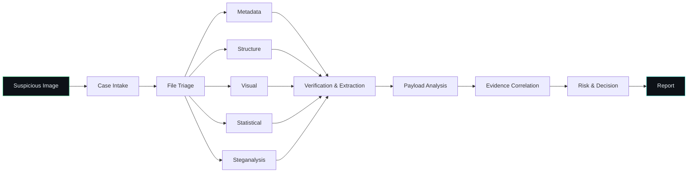
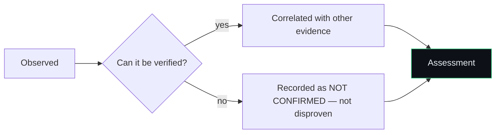

<p align="center">
  
</p>

<p align="center">
  
  
  
  
</p>

<p align="center">
  A modular framework for examining suspicious image files — from first triage to hidden-data verification, evidence correlation, and automated reporting.
</p>

<blockquote align="center">
  <b>Core idea:</b> a single suspicious finding is never a forensic conclusion by itself.<br>
  Findings from multiple examination stages are correlated before a final assessment is made.
</blockquote>

<p align="center">
  <a href="#what-it-does">What it does</a> ·
  <a href="#pipeline">Pipeline</a> ·
  <a href="#quick-start">Quick start</a> ·
  <a href="#capabilities--tooling">Capabilities</a> ·
  <a href="#validation-dataset">Dataset</a> ·
  <a href="#status">Status</a>
</p>

---

## What it does

You hand the framework an image. It examines that file from several independent angles — metadata, structure, statistics, steganalysis — and treats every hit as a **candidate finding**, not a verdict. Only findings that survive verification and correlate with other evidence make it into the final risk assessment.



## Evidence-driven approach

Detection and verification are deliberately kept separate:



This matters because individual indicators mislead on their own:

- unusual metadata ≠ steganography
- an abnormal histogram ≠ proof of hidden data
- a `zsteg` candidate ≠ a confirmed payload
- a failed extraction attempt ≠ proof nothing is hidden

## Pipeline

<details open>
<summary><b>12-stage examination workflow</b></summary>

| Stage | Purpose |
|---|---|
| **Case Intake** | Hashes and preserves evidence in an isolated case workspace |
| **Triage** | Identifies real file type, size, signatures, strings |
| **Metadata Forensics** | Flags EXIF/XMP anomalies and editing history |
| **Structure Analysis** | Checks for appended, embedded, or carved data |
| **Visual Analysis** | RGB channel and bit-plane views |
| **Statistical Analysis** | LSB distributions, entropy, histograms, regional stats |
| **Steganalysis** | Automated LSB detection via `zsteg` |
| **Verification & Extraction** | Confirms candidates, recovers payloads |
| **Payload Analysis** | Examines any recovered content |
| **YARA Detection** | Signature-based scanning |
| **Correlation & Risk Scoring** | Weighted, explainable verdict |
| **Reporting** | JSON / TXT / PDF forensic reports |

</details>

## Quick start

```bash
git clone https://github.com/Amina-Rash1d/digital-media-forensics.git
cd digital-media-forensics

python3 -m venv venv && source venv/bin/activate
pip install -r requirements.txt

python3 pipeline.py --input path/to/image.png
```

Reports land in `case_reports/<CASE-ID>/`.

## Project structure

```text
digital-media-forensics/
├── src/
│   ├── analysis/       # triage, metadata, structure, visual, statistical, steganalysis, verification
│   ├── core/            # case + file handling
│   ├── correlation/     # evidence normalization, correlation, risk scoring
│   ├── detection/       # YARA scanning
│   ├── reporting/       # forensic report generation
│   └── rules/           # YARA rules
├── data/test_dataset/   # controlled validation samples + ground truth
├── case_reports/        # generated reports
├── pipeline.py           # end-to-end entry point
└── requirements.txt
```

## Validation dataset

<details>
<summary><b>Six controlled test cases</b> — click to expand</summary>

<br>

| Sample | Test condition |
|---|---|
| `TEST-01-clean.png` | Clean reference image |
| `TEST-02-stego.bmp` | Controlled steganographic sample |
| `TEST-03-metadata.png` | Deliberately modified metadata |
| `TEST-04-appended.png` | Data appended after image content |
| `TEST-05-resaved.png` | Normal re-encoded / resaved image |
| `TEST-06-stego.bmp` | Hidden payload requiring verification + extraction |

Ground truth for each sample is documented in `data/test_dataset/GROUND_TRUTH.txt`, so framework output can be checked against known conditions.

</details>

## Capabilities & tooling

<details>
<summary><b>Full technique list + tech stack</b> — click to expand</summary>

<br>

| Area | Purpose |
|---|---|
| File Triage | Real file type, size, signatures, characteristics |
| Metadata Forensics | EXIF/XMP anomaly detection |
| Structure Analysis | Appended / embedded / unusual data |
| Visual Analysis | RGB + bit-plane rendering |
| Statistical Analysis | LSB, entropy, histograms, regional stats |
| Steganalysis | `zsteg`-based LSB detection |
| Verification & Extraction | Candidate confirmation, payload recovery |
| Payload Analysis | Recovered-content characterization |
| YARA Detection | Signature scanning |
| Correlation & Risk | Explainable combined assessment |
| Reporting | Machine- and human-readable output |

**Built with:** Python · ExifTool · Binwalk · `zsteg` · Steghide · YARA · Pillow · NumPy · ReportLab

</details>

## Status

**Student / learning project — actively developed.** Built for practicing digital media forensics and evidence-driven reasoning; not intended for production evidentiary use without further validation.

---

<p align="center">
  <b>Amina Rashid</b><br>
  Cybersecurity Student · Digital Forensics · Steganalysis · Security Automation
</p>
